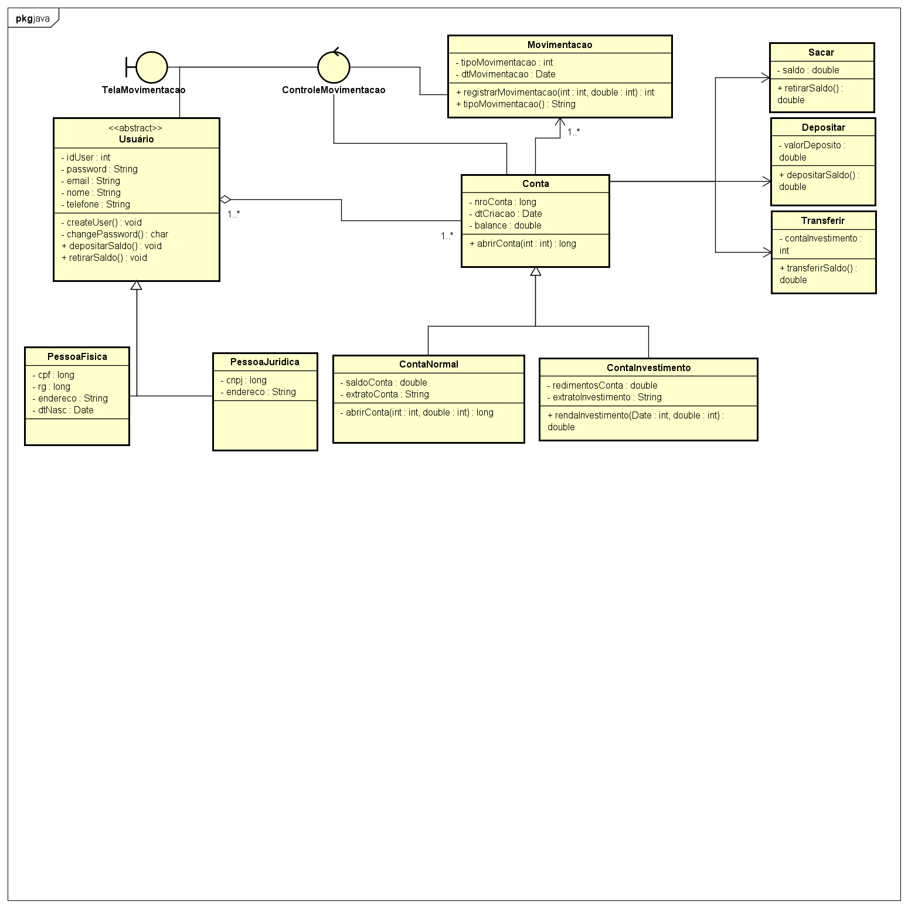

## FINSHARRE
A Fintech, como forma de facilitar o controle das finanças pessoais, traz um ambiente agradável onde é possível acrescentar sua fonte de renda, listar os seus gastos fixos e variavéis e muito mais.

## Estrutura de pastas

O espaço de trabalho contém duas pastas por padrão, onde:

- `src`: a pasta para manter as fontes
- `lib`: a pasta para manter dependências

Enquanto isso, os arquivos de saída compilados serão gerados na pasta `bin` por padrão.

## Gerenciamento de Dependências

>java.time.LocalDateTime;

>java.time.format.DateTimeFormatter;

>java.util.ArrayList;

>java.util.List;

## UML

](assets/Fintech.png)
